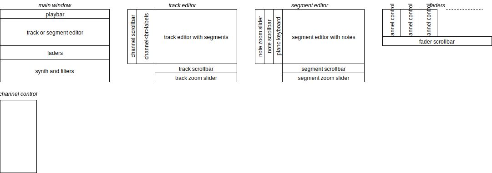

# HOW IT WORKS

# TODO

- *basic structure*
- *channel datastructure*
- *move controls back to the left, separate all scrollbars*
- *put segments on the overview*
- *doubleclick on the segment opens it*
- *style segment editor the same way as the track editor, but headers -> piano*
- *add horizontal zoom to track editor*
- *add horizontal zoom to segment editor*
- *add vertical zoom to segment editor*
- *remove direct access to attributes, use methods*
- *access current channel only through Track, and not through Piano or SegmentEditor*
- *access current segment only through Track, and not through Piano or SegmentEditor*
- *how to get back from segment editor to track editor? - for now just press ESC*
- *renamed Segment to Clip*
- *renamed Note to Key, so Note can be used for something else*
- *abstract note interface in Track.Channel.Clip*
- *paint notes*
- *design a unit for all the graphics: b44 (beat when interpreted as 4/4)*
- *rename offset to vo and zoom to vz*
- *cleanup/optimize calls in editors*
- *clip editor: mouse press, release, double click*
- *note left and right end should change mouse cursor*
- *note drag on left and right change start and length*
- **fix rounding of the note dragging**
- **working piano keyboard via pye connection**
- velocity
- for the scrollbars, make sure the 0 offset is properly recalculated when zooming
- at initialization, make sure the zoom sliders correspond to the current zoom setting

# BUGS

- at initialization self.headers is the wrong height(), unclear why; same with self.track_editor.width()
